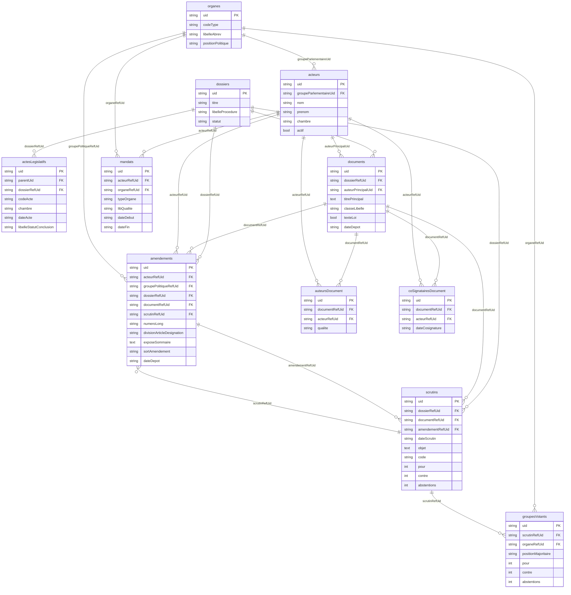

# Assemblée Nationale

TODO: petite présentation du projet.

## Description des données

Nous utilisons l'API des [tricoteuses](https://www.tricoteuses.fr/) pour récupérer les données. Voici le lien vers la [documentation](https://parlement.tricoteuses.fr/docs#description/introduction).


L'Assemblée nationale travaille à partir de dossiers législatifs. Un dossier législatif permet de suivre l'évolution d'un texte législatif : en commission, au Sénat, amendements... Deux types de textes législatifs nous intéressent : proposition de loi proposée par un député, projet de loi proposé par le gouvernement.

Voici les différents endpoint: 
* dossiers => `https://parlement.tricoteuses.fr/dossiers`
* texte de loi => `https://parlement.tricoteuses.fr/documents`
* amendements => `https://parlement.tricoteuses.fr/amendements`
* députés => `https://parlement.tricoteuses.fr/acteurs`
* votes => `https://parlement.tricoteuses.fr/scrutins`
* actes de la procédure => `https://parlement.tricoteuses.fr/actesLegislatifs`


[Information sur le chemin d'une loi](https://www.assemblee-nationale.fr/dyn/actualites-accueil-hub/le-parcours-de-la-loi)
[Les documents parlementaires](https://www.assemblee-nationale.fr/dyn/documents-parlementaires)

[Documentation technique de l'API des tricoteuses](https://parlement.tricoteuses.fr/docs#description/introduction)

# Contributing


## Installation

### Dépendances à installer

- [Installation de Python](#installation-de-python)
- [Installation d'UV](https://docs.astral.sh/uv/)

### Setup

1. Installer les dépendances :
```bash
uv sync
```

2. Créer le fichier `.env` à partir de l'exemple, puis l'adapter si besoin :
```bash
cp .env.example .env
```

3. Démarrer PostgreSQL (instance locale définie dans `docker-compose.yml`, sur le port `5432`) :
```bash
docker compose up -d db
```
Les valeurs par défaut de `.env.example` correspondent à ce conteneur (`postgres`/`postgres`, base `ipolitics`).

### Usages

#### Exécuter des commandes

Il y a deux façons d'exécuter des commandes:
* uv run main.py [-h] [-d] [-r] [-e] [-a]
* just

[Just](https://just.systems/man/en/) permet de facilement exécuter des commandes. Si vous ne voulez pas l'installer, vous pouvez toujours utiliser `uv run main.py`

#### Télécharger les données sur l'API des tricoteuses

La commande suivante va télécharger sur l'API des [tricoteuses](https://www.tricoteuses.fr/) et créer des fichiers JSON dans le répertoire `./data/`. Pour rajouter un endpoint, il suffit de modifier la variable `APIS` dans `./etl/download.py`

```bash
uv run main.py -d
# ou
just download
```

#### Construire la base de donnée

```bash
uv run main.py -r
# ou
just db-rebuild
```

#### Exécuter l'ETL

```bash
uv run main.py -e
# ou
just etl
```


#### Recréer la DB et exécuter l'ETL

```bash
uv run main.py -a
# ou
just all
```

#### Recréer la DB vectorielle (DuckDB)

```bash
uv run main.py --rebuild-vector-database
# ou
just vector-db-rebuild
```

#### Calculer les embeddings

```bash
uv run main.py --embed
# ou
just embed
```

Pour ne traiter que les amendements d'un seul dossier (utile pour itérer sur un
texte précis sans réembedder tout le corpus) :

```bash
just embed --dossier DLR5L16N47129
```

## Application web

Un seul processus Python sert tout : les pages HTML (`web/`, gabarits Jinja) et
l'API JSON (`api/`, qui porte le SQL, les agrégations et la similarité). Les vues
HTML appellent directement les fonctions de service des routeurs — pas d'appel
HTTP interne — si bien que les deux interfaces partagent une seule implémentation
des requêtes.

```text
navigateur ──► /                     (HTML, web/views/ + gabarits Jinja)
               /dossiers/{uid}…          └──┐
               /api/**               (JSON, api/routers/)
                                         └──┴──► fonctions de service
                                                    ├──► Postgres  (api/db.py)
                                                    └──► DuckDB    (api/similarity.py)
```

Aucun outillage Node : pas de `package.json`, pas d'étape de build. Les
interactions de liste (recherche, facettes, tri, pagination) passent par
[HTMX](https://htmx.org/), qui échange un fragment de page ; les deux seules
fonctions ayant besoin d'un état client persistant (historique de consultation,
seuil de similarité) sont écrites en [Alpine.js](https://alpinejs.dev/). Les deux
bibliothèques sont chargées depuis un CDN.

### Lancer l'application

```bash
uv run uvicorn api.main:app --reload
# ou
just serve
```

Interface sur <http://localhost:8000>, documentation interactive de l'API sur
<http://localhost:8000/docs>, sonde de disponibilité sur
<http://localhost:8000/health> (état de Postgres et de l'index de similarité).

Pages HTML :

| Route | Contenu |
| --- | --- |
| `GET /` | Accueil : compteurs globaux et liste de dossiers filtrable (`q`, `withMentions`, `page`) |
| `GET /dossiers/{uid}` | Fiche dossier : compteurs, parcours législatif, dépôts par semaine, mentions par groupe |
| `GET /dossiers/{uid}/amendements` | Explorateur d'amendements : facettes, tri, pagination |
| `GET /dossiers/{uid}/mentions` | Diagramme de flux groupe politique → acteur extérieur cité |
| `GET /amendements/{uid}` | Fiche amendement : auteur, dispositif, mentions, scrutin, amendements proches |
| `GET /scrutins/{uid}` | Scrutin public, hémicycle et vote agrégé par groupe |

Chaque route de liste répond soit la page entière, soit le seul bloc de résultats
quand HTMX le demande (en-tête `HX-Request`), depuis le même contexte de gabarit :
recharger une URL filtrée produit exactement ce qu'un échange HTMX aurait produit.

API JSON, publiée pour les consommateurs tiers :

| Route | Contenu |
| --- | --- |
| `GET /api/stats` | Compteurs globaux (dossiers, amendements, mentions, scrutins) |
| `GET /api/dossiers` | Liste filtrée et paginée (`q`, `page`, `procedure`, `statut`, `withMentions`) |
| `GET /api/dossiers/{uid}` | Fiche dossier : compteurs, parcours du texte (`steps`), dépôts par semaine, mentions par groupe |
| `GET /api/dossiers/{uid}/amendements` | Amendements du dossier, filtrés/triés/paginés |
| `GET /api/dossiers/{uid}/mentions` | Flux groupe → entité externe, pour le diagramme |
| `GET /api/amendements/{uid}` | Fiche amendement : auteur, mentions, scrutin, amendements proches |
| `GET /api/amendements/{uid}/similar` | Voisins seuls (`k`, `threshold`) |
| `GET /api/scrutins/{uid}` | Scrutin public et vote agrégé par groupe |

L'interface étant servie par ce même processus, elle est de même origine et ne
nécessite aucun réglage CORS : `API_ALLOWED_ORIGINS` ne sert qu'à autoriser une
application extérieure à interroger `/api/**`.

### Similarité entre amendements

Les scores affichés sont des similarités cosinus entre embeddings. Elles
nécessitent donc `just embed` au préalable ; sans base vectorielle, l'application
démarre normalement, l'API renvoie `similarityAvailable: false` et l'interface
indique que la similarité est indisponible plutôt que d'annoncer à tort qu'aucun
amendement proche n'existe.

## Comment marche l'ETL

Après avoir exécuté `just download`, les données de l'API des tricoteuses sont sauvegardées dans le dossier `./data/` sous la forme de fichiers JSON.
L'ETL permet d'extraire des données de ces fichiers pour les sauvegarder dans la base de données. La base de données est représentée à l'aide de 
modèles créés via [SqlAlchemy](https://docs.sqlalchemy.org/en/20/).

Pour charger **un fichier** en db, il faut rajouter un modèle qui porte le même nom que le fichier sans l'extension.
Pour rajouter **un champ** du json dans la table, il faut rajouter une colonne dans le modèle du même type que le json et du même nom.

L'ETL est capable d'inférer à partir des modèles les fichiers à ouvrir et les champs à charger.

### Exemple


Voici une partie du fichier `./data/dossiers.json`
```json
  {
    "uid": "DLR5L17N54464",
    "dataset": 17,
    "chambre": "AN",
    "numero": "4464",
    ...
    }
```

Je veux rajouter le champ `chambre` dans la DB et faire en sorte que l'ETL l'ajoute de lui-même.
1. Rajouter le champ dans le modèle
```python
class Dossier(Base):
    __tablename__ = "dossiers"

    uid: Mapped[str] = mapped_column(primary_key=True)
    titre: Mapped[str] = mapped_column(String(1000))
    dataset: Mapped[int]
    chambre: Mapped[str] = mapped_column(String(5)) # <-------- nouvelle colonne qui porte le même nom que le champ du fichier json
```

Le champ doit porter le même nom sinon l'ETL ne sera pas capable de le trouver.

2. Exécuter `just all`

## Objets parlementaires chargés


| Table | Endpoint | Contenu | Volume (législature 17) |
|---|---|---|---|
| `actesLegislatifs` | `/actesLegislatifs` | Actes datés de la procédure : dépôts, lectures, CMP, décisions, saisines, promulgation | ~21 400 |
| `acteurs` | `/acteurs` | Députés / sénateurs (référentiel trans-législature) | ~3 100 |
| `organes` | `/organes` | Groupes politiques, commissions, assemblées… | ~5 400 |
| `mandats` | `/mandats` | Jointure acteur ↔ organe (appartenance + dates) | ~25 600 |
| `scrutins` | `/scrutins` | Scrutins publics et résultat agrégé (pour/contre/abstentions) | ~8 200 |
| `groupesVotants` | `/groupesVotants` | Résultat d'un scrutin ventilé par groupe politique | ~121 500 * |
| `documents` | `/documents` | Textes (projets/propositions de loi, rapports…) | ~4 500 |
| `auteursDocument` | `/auteursDocument` | Auteur(s) d'un document | ~20 000 |
| `coSignatairesDocument` | `/coSignatairesDocument` | Co-signataires d'un document | ~116 000 |

\* `groupesVotants` n'expose pas de filtre `legislature` : la table couvre toutes les législatures
(~98 300 lignes se rattachent à un scrutin de la L17, soit 12 groupes pour chacun des 8 192
scrutins concernés). Se scoper par jointure sur `scrutins`.

Les jointures se font par les colonnes `…RefUid` (références molles, nullable, indexées). Schéma
entité-relation ci-dessous — les boîtes ne montrent que les colonnes clés (PK + FK + quelques
champs parlants) ; la liste complète est dans les modèles `models/`.



Le lien **amendement ↔ scrutin** est natif, et dans les deux sens : `scrutins.amendementRefUid`
pointe vers l'amendement tranché par le scrutin, et `amendements.scrutinRefUid` vers le scrutin
qui a tranché l'amendement. Le second est le plus large (~11 600 amendements contre ~6 800),
un même scrutin pouvant trancher plusieurs amendements identiques. La jointure reste clairsemée :
la plupart des amendements sont tranchés à main levée, sans scrutin public.

Le **parcours d'un texte** se reconstitue depuis `actesLegislatifs` (`web/legislative.py`) :
`dossiers.statut` ne donne que l'étape courante, alors que le parcours complet est une suite
d'étapes de longueur variable — deux pour un texte fraîchement déposé, dix pour la loi
« fin de vie » (`DLR5L17N51670` : deux lectures dans chaque chambre, CMP en désaccord, nouvelle
lecture, lecture définitive, Conseil constitutionnel). Les actes sont regroupés par préfixe de
`codeActe` (`AN1`, `SN1`, `CMP`, `ANNLEC`, `ANLDEF`, `CC`, `PROM`…) plutôt qu'en remontant
`parentUid` : sur un dossier ouvert sous une législature antérieure, une partie des actes
référence un parent absent du jeu de données et serait comptée comme une étape à part. Le sort
d'une étape se lit sur son dernier acte porteur d'un `libelleStatutConclusion`.

# Analyse : détection des mentions de collaboration externe

Objectif : repérer les amendements dont l'exposé sommaire déclare une collaboration ou une
inspiration avec une **entité externe** (lobby, syndicat, association, entreprise, fédération
professionnelle, ONG…) — formulations du type « travaillé avec… », « en concertation avec… »,
« inspiré de… ».

Le détecteur (`analysis/detect_mentions_regex.py`) fonctionne par expressions régulières :
déterministe, instantané et sans coût, il matche des familles de formulations calibrées sur
le corpus réel, avec des exclusions contextuelles (acteurs publics ou parlementaires, référents
textuels type « proposé par le texte ») pour limiter les faux positifs.

## Lancer une analyse

La base doit être alimentée au préalable (table `amendements`, voir les sections ETL ci-dessus).

```bash
# Tout le corpus, résultats en JSONL uniquement
just detect-mentions-regex

# + écriture des mentions dans la table amendement_mentions
just detect-mentions-regex --persist

# Sur un sous-ensemble
just detect-mentions-regex --limit 100

# Équivalent sans just :
uv run python -m analysis.detect_mentions_regex --persist
```

## Sorties

- **JSONL brut** : `analysis/output/mentions_regex.jsonl` (une ligne par amendement, dossier
  gitignoré), plus un récap console des formulations rencontrées et de leur fréquence.
- **Base** (avec `--persist`) : table `amendement_mentions`, une ligne par mention détectée
  (`amendementUid`, `citation`, `formulation`, `modele='regex:v1'`, `createdAt`). L'écriture est
  idempotente par amendement et scopée au tag `modele='regex:v1'` : les lignes produites par
  d'autres détecteurs (ex. un LLM) ne sont jamais touchées.
- Le repérage regex ne remplit ni `entite`, ni `typeEntite`, ni `externe` : identifier et
  qualifier l'entité demande une analyse sémantique (prévue dans une itération ultérieure).

## Tables d'analyse et rebuild

`amendement_mentions` est une **table d'analyse** : elle n'est pas listée dans `ETL_TABLES`
(`etl/database.py`) et **survit donc à un `db-rebuild`**, contrairement à `amendements`/`dossiers`
qui sont détruites puis rechargées. Sa colonne `amendementUid` est une référence *molle* vers
`amendements.uid` (pas de `ForeignKey`), afin qu'aucune contrainte ne bloque le drop de la table
ETL. Pour ajouter une nouvelle analyse, créer un modèle sur ce principe (hors `ETL_TABLES`).
