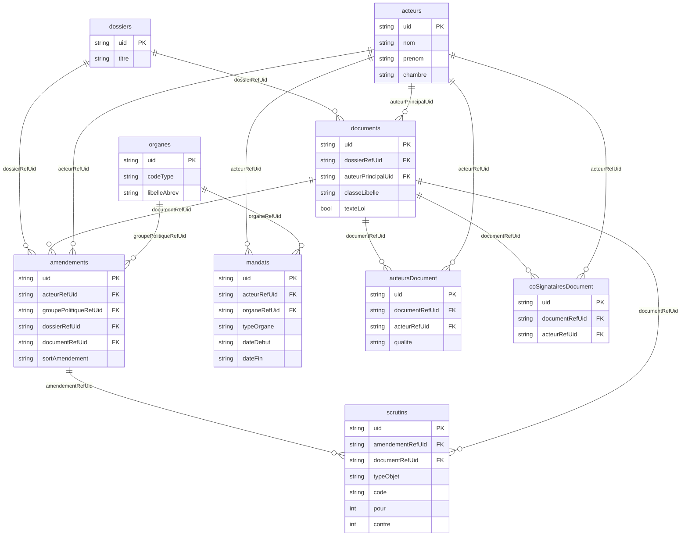

# Assemblée Nationale

TODO: petite présentation du projet.

## Description des données

Nous utilisons l'API des [tricoteuses](https://www.tricoteuses.fr/) pour récupérer les données. Voici le lien vers la [documentation](https://parlement.tricoteuses.fr/docs#description/introduction).


L'Assemblée nationale travaille à partir de dossiers législatifs. Un dossier législatif permet de suivre l'évolution d'un texte législatif : en commission, au Sénat, amendements... Deux types de textes législatifs nous intéressent : proposition de loi proposée par un député, projet de loi proposé par le gouvernement.

Voici les différents endpoint: 
* dossiers => `https://parlement.tricoteuses.fr/dossiers`
* texte de loi => `https://parlement.tricoteuses.fr/documents`
* amendements => `https://parlement.tricoteuses.fr/amendements`
* députés => `https://parlement.tricoteuses.fr/acteurs`
* votes => `https://parlement.tricoteuses.fr/scrutins`


[Information sur le chemin d'une loi](https://www.assemblee-nationale.fr/dyn/actualites-accueil-hub/le-parcours-de-la-loi)
[Les documents parlementaires](https://www.assemblee-nationale.fr/dyn/documents-parlementaires)

[Documentation technique de l'API des tricoteuses](https://parlement.tricoteuses.fr/docs#description/introduction)

# Contributing


## Installation

### Dépendances à installer

- [Installation de Python](#installation-de-python)
- [Installation d'UV](https://docs.astral.sh/uv/)

### Setup

1. Installer les dépendances :
```bash
uv sync
```

2. Créer le fichier `.env` à partir de l'exemple, puis l'adapter si besoin :
```bash
cp .env.example .env
```

3. Démarrer PostgreSQL (instance locale définie dans `docker-compose.yml`, sur le port `5432`) :
```bash
docker compose up -d db
```
Les valeurs par défaut de `.env.example` correspondent à ce conteneur (`postgres`/`postgres`, base `ipolitics`).

### Usages

#### Exécuter des commandes

Il y a deux façons d'exécuter des commandes:
* uv run main.py [-h] [-d] [-r] [-e] [-a]
* just

[Just](https://just.systems/man/en/) permet de facilement exécuter des commandes. Si vous ne voulez pas l'installer, vous pouvez toujours utiliser `uv run main.py`

#### Télécharger les données sur l'API des tricoteuses

La commande suivante va télécharger sur l'API des [tricoteuses](https://www.tricoteuses.fr/) et créer des fichiers JSON dans le répertoire `./data/`. Pour rajouter un endpoint, il suffit de modifier la variable `APIS` dans `./etl/download.py`

```bash
uv run main.py -d
# ou
just download
```

#### Construire la base de donnée

```bash
uv run main.py -r
# ou
just db-rebuild
```

#### Exécuter l'ETL

```bash
uv run main.py -e
# ou
just etl
```


#### Recréer la DB et exécuter l'ETL

```bash
uv run main.py -a
# ou
just all
```


## Comment marche l'ETL

Après avoir exécuté `just download`, les données de l'API des tricoteuses sont sauvegardées dans le dossier `./data/` sous la forme de fichiers JSON.
L'ETL permet d'extraire des données de ces fichiers pour les sauvegarder dans la base de données. La base de données est représentée à l'aide de 
modèles créés via [SqlAlchemy](https://docs.sqlalchemy.org/en/20/).

Pour charger **un fichier** en db, il faut rajouter un modèle qui porte le même nom que le fichier sans l'extension.
Pour rajouter **un champ** du json dans la table, il faut rajouter une colonne dans le modèle du même type que le json et du même nom.

L'ETL est capable d'inférer à partir des modèles les fichiers à ouvrir et les champs à charger.

### Exemple


Voici une partie du fichier `./data/dossiers.json`
```json
  {
    "uid": "DLR5L17N54464",
    "dataset": 17,
    "chambre": "AN",
    "numero": "4464",
    ...
    }
```

Je veux rajouter le champ `chambre` dans la DB et faire en sorte que l'ETL l'ajoute de lui-même.
1. Rajouter le champ dans le modèle
```python
class Dossier(Base):
    __tablename__ = "dossiers"

    uid: Mapped[str] = mapped_column(primary_key=True)
    titre: Mapped[str] = mapped_column(String(1000))
    dataset: Mapped[int]
    chambre: Mapped[str] = mapped_column(String(5)) # <-------- nouvelle colonne qui porte le même nom que le champ du fichier json
```

Le champ doit porter le même nom sinon l'ETL ne sera pas capable de le trouver.

2. Exécuter `just all`

## Objets parlementaires chargés


| Table | Endpoint | Contenu | Volume (législature 17) |
|---|---|---|---|
| `acteurs` | `/acteurs` | Députés / sénateurs (référentiel trans-législature) | ~3 100 |
| `organes` | `/organes` | Groupes politiques, commissions, assemblées… | ~6 100 |
| `mandats` | `/mandats` | Jointure acteur ↔ organe (appartenance + dates) | ~25 600 |
| `scrutins` | `/scrutins` | Scrutins publics et résultat agrégé (pour/contre/abstentions) | ~8 300 |
| `documents` | `/documents` | Textes (projets/propositions de loi, rapports…) | ~4 500 |
| `auteursDocument` | `/auteursDocument` | Auteur(s) d'un document | ~20 000 |
| `coSignatairesDocument` | `/coSignatairesDocument` | Co-signataires d'un document | ~116 000 |

Les jointures se font par les colonnes `…RefUid` (références molles, nullable, indexées). Schéma
entité-relation ci-dessous — les boîtes ne montrent que les colonnes clés (PK + FK + quelques
champs parlants) ; la liste complète est dans les modèles `models/`.



Le lien **amendement ↔ scrutin** est natif : `scrutins.amendementRefUid` pointe vers
`amendements.uid` (quand `scrutins.typeObjet = 'amendement'`). Seule une minorité d'amendements
passe par un scrutin public (les autres sont tranchés à main levée), la jointure est donc
volontairement clairsemée.
